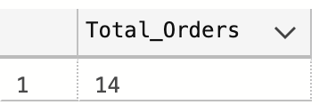
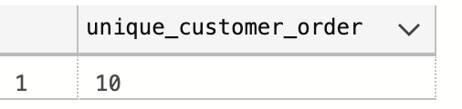
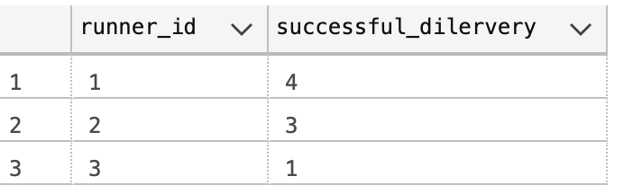
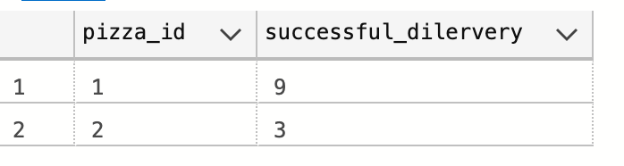
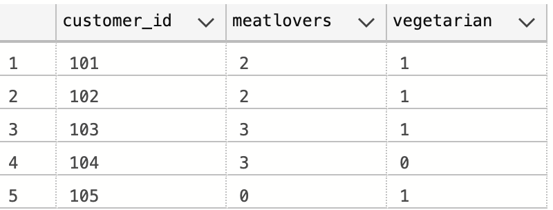
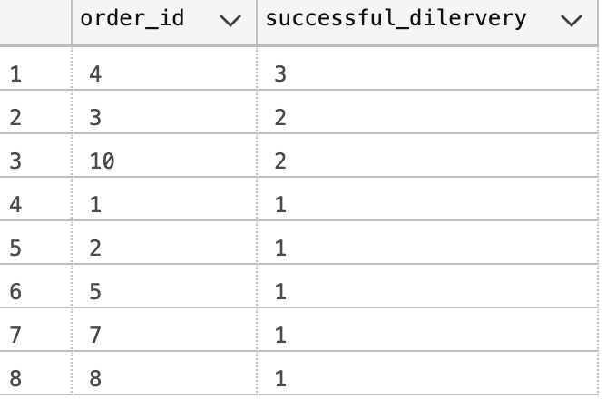
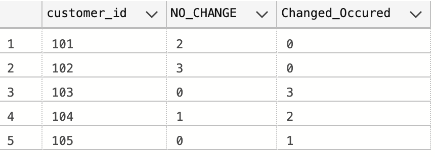
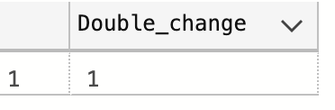
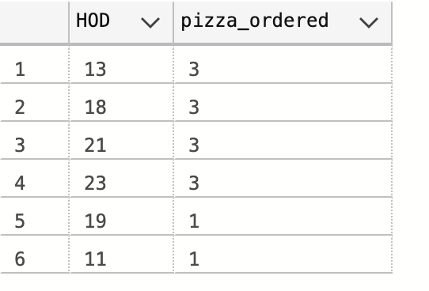
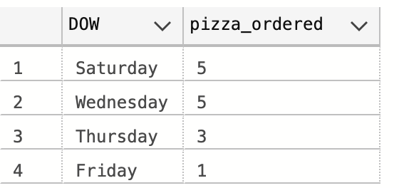

# Case Study #2 - Pizza Runner
## A. Pizza Metrics
### 1. How many pizzas were ordered?
#### Steps:
  - Use the aggregate function COUNT to get the Total_oders

```sql
Select COUNT(1) as Total_Orders
From pizza_runner.customer_orders;
```
#### Output:

- A total of 14 pizzas were ordered

### 2. How many unique customer orders were made?
#### Steps:
  - Use DISTINCT function to find the unique customer orders  
```sql
Select COUNT(distinct order_id) as unique_customer_order
From pizza_runner.customer_orders;
```
#### Output:

- 10 Unique customers 

### 3. How many successful orders were delivered by each runner?
#### Steps:
  - Filter where the distance information is not given as Unsucesssful delivery
  - Group by runnder_id
```sql
Select runner_id,Count(*) as successful_dilervery
From pizza_runner.runner_orders 
Where distance != 'null'
Group by runner_id;
```
#### Output:


### 4. How many of each type of pizza was delivered?
#### Steps:
  - Join the customer_orders table with the runner_orders
  - Filter the Unsucessful delivery with WHERE
  - Count the number of sucessful delivery
  
```sql
Select pizza_id,Count(*) as successful_dilervery
From pizza_runner.customer_orders co
Join pizza_runner.runner_orders ro on co.order_id = ro.order_id
Where distance != 'null'
Group by pizza_id
```
#### Output:


### 5. How many Vegetarian and Meatlovers were ordered by each customer?
#### Steps:
  - Use a CASE statement to SUM up the Vegetarain and Meatlover Pizza Ordered
  - Group by Customer_id
```sql
SELECT customer_id,
COALESCE(SUM(CASE WHEN pizza_id = 1 THEN 1 END),0) AS meatlovers,
COALESCE(SUM(CASE WHEN pizza_id = 2 THEN 1 END),0) AS vegetarian
FROM pizza_runner.customer_orders
GROUP BY customer_id
```
#### Output:


### 6. What was the maximum number of pizzas delivered in a single order?
#### Steps:
  - Join the customer_orders table with the runner_orders
  - Filter the Unsucessful delivery 
  - Count the number of sucessful delivery
  - Group by order_id

```sql
Select co.order_id,Count(*) as successful_dilervery
From pizza_runner.customer_orders co
Join pizza_runner.runner_orders ro on co.order_id = ro.order_id
Where distance != 'null'
Group by co.order_id
Order by 2 desc
```
#### Output:


### 7. For each customer, how many delivered pizzas had at least 1 change and how many had no changes?
#### Steps:
  - Create a CTE, within the CTE Use CASE to replace null value for exclusion and extra and also filter unsuccessful delivery
- Using the CTE table COUNT how many delivered pizza had at least 1 change Using CASE statement and AND, at least no change Using CASE statement and OR
- Group By customer_id
```sql
With temp_table as (
	SELECT co.order_id,customer_id,exclusions,extras,distance,
	CASE WHEN exclusions IN ('null','') THEN 0 ELSE 1 End AS exlusions_change,
	Case when extras IN ('null','') Or extras IS NULL THEN 0 ELSE 1 END as extras_change
	From pizza_runner.customer_orders co
	Join pizza_runner.runner_orders ro on co.order_id = ro.order_id
	Where distance != 'null') 
Select customer_id,
 COUNT (CASE WHEN exlusions_change = 0 and extras_change = 0 THEN 0 END) AS NO_CHANGE,
 COUNT (CASE WHEN exlusions_change = 1 OR extras_change = 1 THEN 1 END) AS Changed_Occured
FROM temp_table
Group by customer_id
```
#### Output:


### 8. How many pizzas were delivered that had both exclusions and extras?
#### Steps:
- Create a CTE, within the CTE Use CASE to replace null value for exclusion and extra and also filter unsuccessful delivery
- Using the CTE table COUNT how many delivered pizza had both exclusions and extras Using CASE statement and AND
- Group By customer_id
```sql
With temp_table as (
	SELECT co.order_id,customer_id,exclusions,extras,distance,
	CASE WHEN exclusions IN ('null','') THEN 0 ELSE 1 End AS exlusions_change,
	Case when extras IN ('null','') Or extras IS NULL THEN 0 ELSE 1 END as extras_change
	From pizza_runner.customer_orders co
	Join pizza_runner.runner_orders ro on co.order_id = ro.order_id
	Where distance != 'null') 
Select 
 COUNT (CASE WHEN exlusions_change = 1 and extras_change = 1 THEN 1 END) AS Double_change
-- COUNT (CASE WHEN exlusions_change = 1 OR extras_change = 1 THEN 1 END) AS Changed_Occured
FROM temp_table
```
#### Output:


### 9. What was the total volume of pizzas ordered for each hour of the day?
#### Steps:
- Sub-query: DATEPART use to derive the hour  from order_time
- Outer-query: Use the hour derived in Sub-query and Count all orders
- Group By Hour of the day

```sql
SELECT HOD, COUNT(*) AS pizza_ordered
 FROM(	SELECT DATEPART(hour FROM order_time) AS hod
		FROM pizza_runner.customer_orders) AS temp_table
GROUP BY hod
ORDER BY pizza_ordered DESC
```
#### Output:


### 10. What was the volume of orders for each day of the week?
#### Steps:
- Sub-query: DATENAME use to derive the name of the weekday
- Outer-query: Use the Name of the weekday derived in the Sub-query and Count all orders
- Group By Weekday
```sql
SELECT DOW, COUNT(*) AS pizza_ordered
 FROM(	SELECT DATENAME(WEEKDAY,order_time) AS DOW -- I got to use datename
		FROM pizza_runner.customer_orders) AS temp_table
GROUP BY DOW
ORDER BY 2 DESC
```
#### Output:

