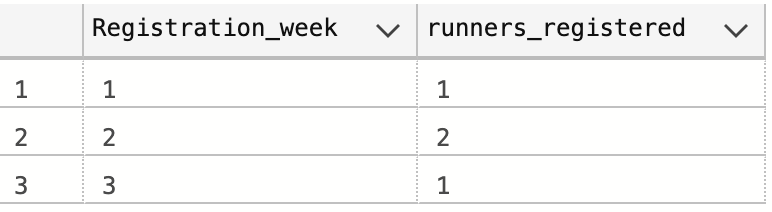
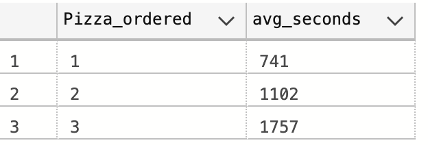

# Case Study #2 - Pizza Runner

## B. ****Runner and Customer Experience****

### 1. How many runners signed up for each 1 week period? (i.e. week starts 2021-01-01)

### Steps:

- SUB-QUERY: derive the week name using DATENAME as Registration_week
- OUTER QUERY: call out Registration_week and COUNT runner_id
- GROUP BY Registration_week

```sql
SELECT Registration_week,Count(runner_id) AS runners_registered
FROM (
		SELECT runner_id, datename(week,registration_date) AS Registration_week,registration_date 
		From pizza_runner.runners
	) AS TEMP_TABLE
Group by Registration_week

```

### Output:




### 2. What was the average time in minutes it took for each runner to arrive at the Pizza Runner HQ to pick up the order?

### Steps:
- 

```sql
with runner_orders AS
(
SELECT order_id, runner_id,
		CASE WHEN pickup_time IN ('null','') THEN NULL ELSE CONVERT(DATETIME,pickup_time)
		END AS pickup_time, 
		distance,  duration,
		CASE WHEN cancellation IN ('null', '') OR cancellation IS NULL THEN 0 ELSE 1 END AS cancellation
	FROM pizza_runner.runner_orders
)

SELECT  runner_id,AVg((DATEDIFF(s,co.order_time, pickup_time)/60)) as Average_minutes
From runner_orders ro
left Join ( SELECT DISTINCT order_id, order_time
      FROM pizza_runner.customer_orders) as co ON ro.order_id = co.order_id
Group by runner_id

```

### Output:


### 3. Is there any relationship between the number of pizzas and how long the order takes to prepare?

### Steps:

- 

```sql
with runner_orders AS
(SELECT  ro.order_id,runner_id,
		CASE WHEN pickup_time IN ('null','') THEN NULL ELSE CONVERT(DATETIME,pickup_time) --https://www.w3schools.com/sql/sql_dates.asp
		END AS pickup_time, 
		distance,  duration,
		CASE WHEN cancellation IN ('null', '') OR cancellation IS NULL THEN 0 ELSE 1 END AS cancellation
	FROM pizza_runner.runner_orders ro
	Where distance != 'null'
),

Pizza_details AS (
Select ro.order_id,Pizza_ordered,runner_id,pickup_time,order_time, DATEDIFF(s,co.order_time, pickup_time) as time_taken_seconds
From runner_orders ro
Left JOIN (
	Select order_id, 
	count(*) as Pizza_ordered,
	MIN(order_time) as order_time
	From pizza_runner.customer_orders
	Group by order_id) as co ON ro.order_id = co.order_id)

Select Pizza_ordered,AVG(time_taken_seconds) as avg_seconds
From Pizza_details
Group by Pizza_ordered
```

### Output:



### 4. What was the average distance traveled for each customer?

### Steps:

- 

```sql
With runner_orders As 
(
	Select Order_id,
	CASE when distance IN ('null','') Then NULL 
	ELSE convert (float,Trim('km' from distance)) end as distance
	From pizza_runner.runner_orders

),

Pizza_details as
(
Select distance,co.order_id,co.customer_id
From runner_orders ro
Left join (
	Select Order_id,customer_id from pizza_runner.customer_orders)
	as co ON ro.order_id = co.order_id
)

Select customer_id, AVG(distance) as avg_km
From Pizza_details
Group by customer_id

Select Customer_id, avg(distance) as Avg_km
From (
Select ro.Order_id, co.customer_id,
	CASE when distance IN ('null','') Then NULL 
	ELSE convert (float,Trim('km' from distance)) end as distance
	From pizza_runner.runner_orders ro
Join pizza_runner.customer_orders co on ro.order_id = co.order_id
) as temp_table
Group by Customer_id

```

### Output:


### 5. What was the difference between the longest and shortest delivery times for all orders?

### Steps:

- 

```sql
Select longest_delivery, shortest_delivery, longest_delivery-shortest_delivery as Difference
From
(Select max(convert(int,Trim('minutes' from duration))) as longest_delivery,
min(convert(int,Trim('minutes' from duration))) as shortest_delivery
From pizza_runner.runner_orders
Where distance != 'null') as temp

```

### Output:


### 6. What was the average speed for each runner for each delivery and do you notice any trend for these values?

### Steps:

- 

```sql
Select runner_id,order_id, Round(distance/duration,2) as Km_per_hr
From(Select runner_id,order_id,convert(int,Trim('minutes' from duration))/60.0 as duration, convert(float,Trim('km' from distance)) as distance
From pizza_runner.runner_orders
Where distance != 'null') as temp
order by 1

```

### Output:


### 7. What is the successful delivery percentage for each runner?

### Steps:

- 

```sql
with runner_orders as (
 SELECT order_id, 
  runner_id,
  CASE WHEN cancellation IN ('null', '') OR cancellation IS NULL THEN 0
      ELSE 1 
      END AS cancellation
  FROM pizza_runner.runner_orders
)

Select runner_id, 
COUNT(case when cancellation = 0 then 1 end) as successful,
Count(*) as orders,convert(float,COUNT(case when cancellation = 0 then 1 end))/Count(*) *100 as percent_successful
From runner_orders
Group by runner_id

```

### Output:


