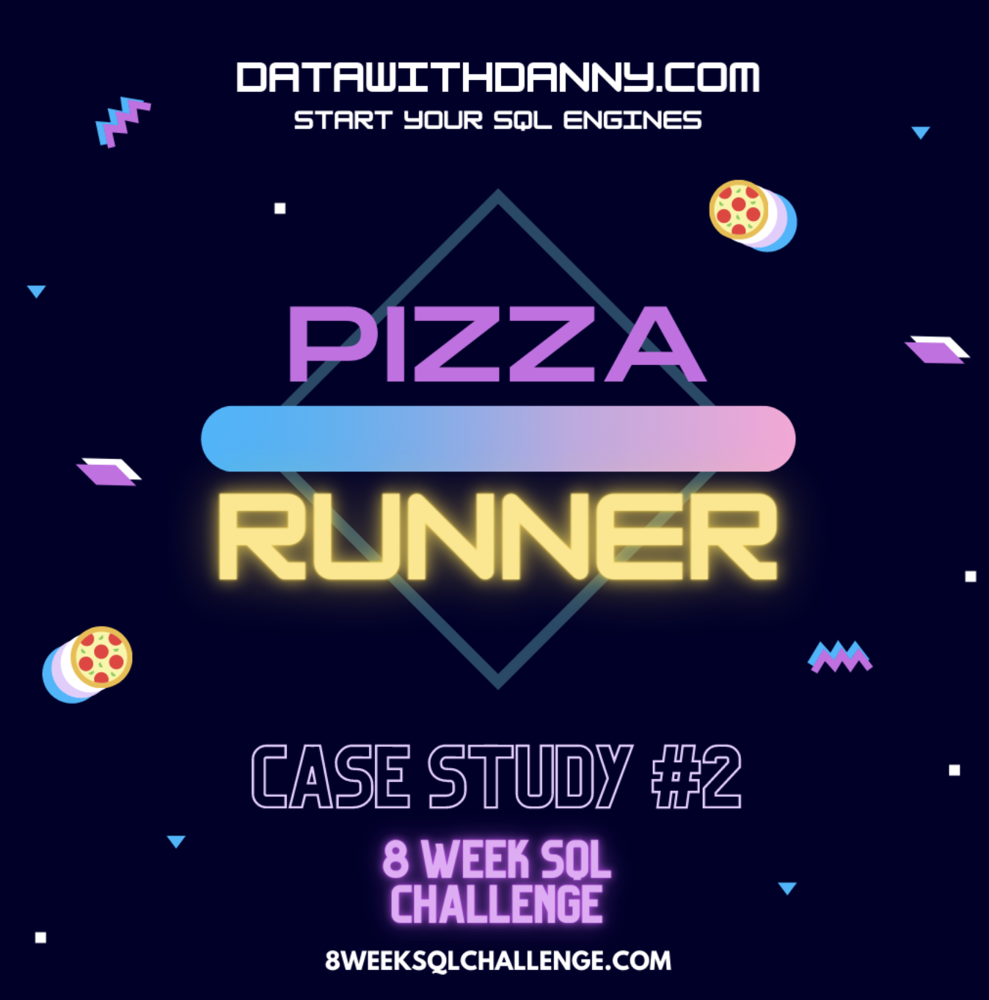
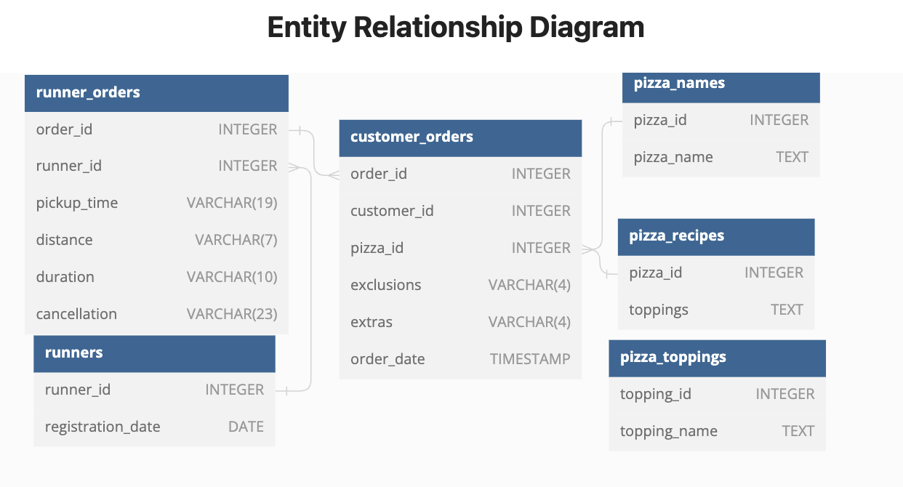

# Case-Study-2-Pizza-Runner

---
This repository hosts the solutions to the 3rd challenge (Week 3) of the 8 Weeks SQL Challenge by DannyMa. [Click here to view the full challenge](https://8weeksqlchallenge.com/case-study-2/)

---
## Table of Contents
- [Business Case](https://github.com/EAtheAnalyst/SQL-Challenge-Case-Study-2-Pizza-Runner/edit/main/README.md#business-case)
- Entity Relationship Diagram
- Available Data
- Case Study Questions

## Business Case
Danny was scrolling through his Instagram feed when something really caught his eye - “80s Retro Styling and Pizza Is The Future!”

Danny was sold on the idea, but he knew that pizza alone was not going to help him get seed funding to expand his new Pizza Empire - so he had one more genius idea to combine with it - he was going to Uberize it - and so Pizza Runner was launched!

Danny started by recruiting “runners” to deliver fresh pizza from Pizza Runner Headquarters (otherwise known as Danny’s house) and also maxed out his credit card to pay freelance developers to build a mobile app to accept orders from customers.

Danny requires further assistance to clean his data and apply some basic calculations so he can better direct his runners and optimise Pizza Runner’s operations.

---
## Entity Relationship Diagram

---
## Available Data

  
All datasets exist in database schema 
  

---
### Case Study Solutions
- [A. Pizza Metrics](https://github.com/EAtheAnalyst/SQL-Challenge-Case-Study-2-Pizza-Runner/blob/6851e3cf413f4a3be2e9b81f1c0ac147292f6cce/A.%20Pizza%20Metrics.md)
- [B. Runner and Customer Experience](https://github.com/EAtheAnalyst/SQL-Challenge-Case-Study-2-Pizza-Runner/blob/6851e3cf413f4a3be2e9b81f1c0ac147292f6cce/B.%20Runner%20and%20Customer%20Experience.md)

